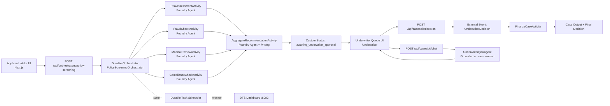

# Durable Multi-Agent Insurance Screening Demo

This workspace contains a realistic insurance policy screening demo with:
- Azure Functions Durable orchestration in Python
- Durable Task Scheduler (DTS) state backend
- Microsoft Agent Framework + Foundry-hosted model calls for multi-agent screening
- Underwriter queue, approval workflow, and case-specific recommendation chat
- Pricing recommendation support and structured validation

## Tech Stack
### Frontend
- Next.js 14 (App Router) + React 18
- TypeScript
- Tailwind CSS
- Native `fetch`-based API integration to backend endpoints

### Backend
- Azure Functions (Python v2 programming model)
- Azure Durable Functions (orchestration, activity, and external event patterns)
- Durable Task Scheduler (DTS) for orchestration state management
- Microsoft Agent Framework (`agent-framework-azure-ai`, `agent-framework-core`)
- Azure AI Agent Server SDK (`azure-ai-agentserver-agentframework`, `azure-ai-agentserver-core`)
- Azure Identity (`DefaultAzureCredential`) for identity-based auth
- Cosmos DB output binding for decision persistence

### Local Tooling and Runtime
- Azure Functions Core Tools (`func`)
- Azurite (local Azure Storage emulator)
- DTS emulator container
- Node.js + npm (frontend build/dev)

## What Is Implemented
- User-friendly intake form that calculates technical fields behind the scenes.
   - `occupationClass` is inferred from a friendly occupation profile.
   - `debtToIncomeRatio` is computed from annual income and monthly debt payments.
- Server-side validation for realistic underwriting constraints.
- Parallel screening agents:
   - RiskAssessmentAgent
   - FraudCheckAgent
   - MedicalReviewAgent
   - ComplianceAgent
- DecisionAggregationAgent generates:
   - decision recommendation
   - rationale
   - pricing recommendation
- Durable external-event pause for underwriter approval/rejection.
- Underwriter queue page with pending decisions and full case context.
- AI chat on pending decision screen:
   - ask questions about recommendation for a specific case
   - answers are grounded in that case's Durable response data

## Architecture Diagram
ASCII view:
```
 +-----------------------+
 | Applicant Intake UI   |
 | (Next.js)             |
 +-----------+-----------+
             |
             | POST /api/orchestrators/policy-screening
             v
 +-----------+-----------------------------------------------+
 | Durable Orchestrator (PolicyScreeningOrchestrator)        |
 +-----------+--------------------+--------------------------+
             |                    |                          |
             | fan-out            | fan-out                  | fan-out
             v                    v                          v
 +-------------------+   +-------------------+     +-------------------+
 | RiskAssessment    |   | FraudCheck        |     | MedicalReview     |
 | Activity/Agent    |   | Activity/Agent    |     | Activity/Agent    |
 +-------------------+   +-------------------+     +-------------------+
             \                    |                          /
              \                   |                         /
               +------------------+------------------------+
                                  |
                                  v
                    +-------------------------------+
                    | ComplianceCheck Activity/Agent|
                    +---------------+---------------+
                                    |
                                    v
                    +-------------------------------+
                    | AggregateRecommendation       |
                    | Activity/Agent + Pricing      |
                    +---------------+---------------+
                                    |
                                    | customStatus: awaiting_underwriter_approval
                                    v
                    +-------------------------------+
                    | Underwriter Queue UI          |
                    | (/underwriter)                |
                    +---------------+---------------+
                                    |
                +-------------------+-------------------+
                |                                       |
                | POST /api/cases/{id}/decision         | POST /api/cases/{id}/chat
                v                                       v
 +-------------------------------+        +-------------------------------+
 | External Event               |        | UnderwriterQnAAgent          |
 | UnderwriterDecision          |        | (grounded case Q&A)          |
 +---------------+--------------+        +---------------+---------------+
                 |                                       |
                 v                                       |
 +-------------------------------+                       |
 | FinalizeCaseActivity          |<----------------------+
 +---------------+---------------+
                 |
                 v
 +-------------------------------+
 | Case Output + Final Decision  |
 +-------------------------------+

 (Durable state for orchestration lifecycle is persisted in Durable Task Scheduler)
```



## Project Structure
- `backend-python-durable/` Durable Functions backend and API endpoints.
- `frontend-ui/` Next.js intake and underwriter workflow UI.

## Quick Start
1. Start Azurite.
```powershell
docker run -p 10000:10000 -p 10001:10001 -p 10002:10002 mcr.microsoft.com/azure-storage/azurite
```

2. Start DTS emulator.
```powershell
docker run -p 8080:8080 -p 8082:8082 mcr.microsoft.com/dts/dts-emulator:latest
```

3. Configure and run backend.
```powershell
cd backend-python-durable
Copy-Item .env.template local.settings.json
python -m venv .venv
.\.venv\Scripts\Activate.ps1
python -m pip install -r requirements.txt
func start
```

4. Configure and run frontend.
```powershell
cd frontend-ui
Copy-Item .env.local.sample .env.local
npm install
npm run dev
```

## Main Endpoints
- `POST /api/orchestrators/policy-screening`
- `GET /api/cases/pending`
- `GET /api/cases/{instanceId}/status`
- `POST /api/cases/{instanceId}/decision`
- `POST /api/cases/{instanceId}/chat`

## URLs
- UI: `http://localhost:3000`
- Functions: `http://localhost:7071`
- DTS dashboard: `http://localhost:8082`
